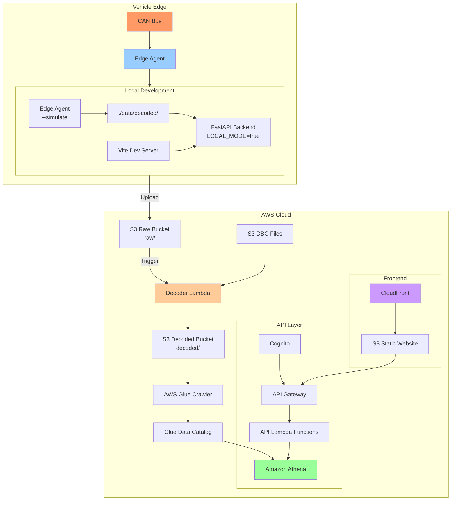

# CAN Bus Telemetry Platform

A complete, production-ready platform for capturing, processing, and visualizing CAN bus telemetry data from vehicles. Built with Python, TypeScript/React, and AWS services.

## Architecture



## Features

- **Edge Agent**: Captures CAN frames from real hardware or simulation, batches to Parquet, uploads to S3 with offline buffering
- **Serverless Processing**: AWS Lambda decodes raw CAN frames using DBC files, writes structured signal data
- **Scalable Storage**: S3 data lake with Hive partitioning, Glue catalog, Athena queries
- **High-Performance API**: FastAPI backend with LTTB downsampling for time-series data
- **Modern Dashboard**: React + TypeScript frontend with Plotly.js for interactive time-series visualization
- **Local Development**: Complete local mode without AWS credentials for rapid development
- **Type-Safe**: Full TypeScript frontend, Python type hints, Pydantic models at API boundaries

## Prerequisites

- **Python**: 3.12+ (edge agent, backend, infrastructure)
- **Node.js**: 20+ (frontend)
- **AWS CLI**: Configured with credentials (for cloud deployment)
- **Docker**: (optional) For containerized local development

## Quick Start

Get the platform running locally in 3 commands:

```bash
# 1. Set up development environment
./scripts/dev-setup.sh

# 2. Generate sample data
cd sample-data/scripts && python generate_sample_data.py && cd ../..

# 3. Run the full stack locally
./scripts/run-local.sh
```

Then open:
- **Frontend**: http://localhost:5173
- **API Docs**: http://localhost:8000/docs

## Project Structure

```
can-telemetry-platform/
├── edge-agent/          # Python: CAN data capture → Parquet → S3
├── infra/               # AWS CDK: Infrastructure as code
├── processing/          # Python: Lambda decoder + Glue jobs
├── backend/             # FastAPI: REST API for querying signals
├── frontend/            # React + TypeScript: Dashboard UI
├── sample-data/         # DBC files + sample Parquet data
├── docs/                # Architecture documentation
├── data/                # Local development data (gitignored)
└── scripts/             # Development utilities
```

## Component Details

### Edge Agent

Runs on vehicle (Raspberry Pi) or development machine. Reads CAN frames, batches to Parquet, uploads to S3.

**Features:**
- Real CAN interface support (SocketCAN, PCAN)
- Simulation mode with realistic signal generation
- Offline buffering with automatic retry
- Configurable batch intervals
- Hive-partitioned output

**Run in simulation mode:**
```bash
cd edge-agent
python -m src.main --config config.yaml --simulate
```

### Infrastructure

AWS CDK (Python) deploys complete cloud infrastructure:
- S3 data lake with lifecycle policies
- Lambda functions for decoding and API
- API Gateway with Cognito authentication
- Glue catalog and Athena workgroup
- CloudFront distribution for frontend

**Deploy:**
```bash
cd infra
cdk deploy
```

### Processing

Lambda function triggered by S3 events, decodes raw CAN Parquet using DBC files.

**Features:**
- Automatic DBC loading from S3
- Graceful error handling per frame
- Signal validation against DBC ranges
- Hive-partitioned output matching input

### Backend

FastAPI application with local and Lambda deployment modes.

**API Endpoints:**
- `GET /vehicles` - List all vehicles
- `GET /vehicles/{id}/sessions` - Get recording sessions
- `GET /vehicles/{id}/messages` - Get CAN messages
- `GET /vehicles/{id}/messages/{msg}/signals` - Get signals
- `POST /vehicles/{id}/query` - Time-series query with LTTB downsampling

**Run locally:**
```bash
cd backend
LOCAL_MODE=true python local_dev.py
```

### Frontend

React + TypeScript dashboard with high-performance charting.

**Stack:** React 19, TypeScript 5.8, Vite 7, Tailwind CSS, Zustand (UI state), TanStack Query (server state), Plotly.js, Axios

**Features:**
- Vehicle and time range selection
- Multi-signal plotting with interactive Plotly.js charts
- Zoom, pan, hover tooltips, and rangeslider
- CSV and PNG export
- Signal statistics (min, max, avg, std dev)
- Dark theme optimized for data visualization

**Run dev server:**
```bash
cd frontend
npm install
npm run dev
```

## Local Development

The platform supports complete local development without AWS:

1. **Edge Agent** runs in `--simulate` mode, writes to `./data/raw/`
2. **Decoder** can process local files without S3
3. **Backend** runs with `LOCAL_MODE=true`, reads from `./data/decoded/`
4. **Frontend** proxies API requests to `localhost:8000`

This enables:
- Fast iteration without cloud costs
- CI/CD testing without AWS credentials
- Offline development

## Docker Compose

For the easiest local setup:

```bash
docker-compose up
```

This starts backend + frontend with sample data pre-loaded.

## Deployment

### Deploy Infrastructure

```bash
cd infra
cdk deploy
```

Note the outputs: API Gateway URL, CloudFront domain, Cognito pool ID.

### Deploy Frontend

```bash
cd frontend
npm run build
aws s3 sync dist/ s3://FRONTEND_BUCKET_NAME/
aws cloudfront create-invalidation --distribution-id DIST_ID --paths "/*"
```

On Windows, a helper script is available:

```bat
cd frontend
deploy.bat
```

### Upload DBC Files

```bash
aws s3 cp sample-data/dbc/ev_powertrain.dbc s3://DATA_BUCKET/dbc/
```

### Start Edge Agent

On vehicle/device:

```bash
cd edge-agent
# Edit config.yaml with your vehicle ID and S3 bucket
python -m src.main --config config.yaml
```

## API Documentation

Once the backend is running, visit `/docs` for interactive Swagger UI.

### Example: Query Signals

```bash
curl -X POST http://localhost:8000/vehicles/VIN_TEST01/query \
  -H "Content-Type: application/json" \
  -d '{
    "signals": [
      {"message_name": "BMS_PackStatus", "signal_name": "Pack_SOC"},
      {"message_name": "MotorCtrl_Status", "signal_name": "Motor_RPM"}
    ],
    "start_time": "2025-02-12T14:00:00Z",
    "end_time": "2025-02-12T14:10:00Z",
    "max_points": 2000
  }'
```

## Sample Data

The `sample-data/` directory includes:

- **ev_powertrain.dbc**: DBC file with 5 CAN messages, 13 signals (BMS, motor, coolant)
- **Pre-generated Parquet files**: 20 minutes of realistic simulated data
- **Generator script**: Regenerate with custom parameters

Signals include:
- Battery cell voltages, pack voltage/current/SOC
- Motor RPM, torque, power
- Motor temperatures (stator, rotor, bearing)
- Coolant temperatures, flow rate, pump duty

## Testing

Run all test suites:

```bash
./scripts/run-tests.sh
```

Or test individual components:

```bash
# Edge agent tests
cd edge-agent && pytest tests/

# Backend tests
cd backend && pytest tests/

# Frontend tests
cd frontend && npm test
```

## Performance

- **Edge Agent**: Handles 1000+ messages/sec, batch window configurable (default 60s)
- **Decoder Lambda**: Processes 10MB Parquet files in ~2 seconds
- **API Query**: Athena scans partitioned data, LTTB downsampling for >5000 points
- **Frontend Chart**: Plotly.js renders interactive time-series with zoom, pan, and hover tooltips

## Cost Optimization

- **S3 Lifecycle**: Raw data → Glacier after 90 days
- **Athena Partitioning**: Hive partitions by vehicle_id, year, month, day reduce scan costs
- **API Caching**: Athena result caching, CloudFront caching
- **Downsampling**: LTTB reduces data transfer and rendering load

## Troubleshooting

### Edge Agent won't connect to CAN interface

```bash
# Check interface is up
ip link show can0

# Bring up interface
sudo ip link set can0 up type can bitrate 500000
```

### Backend can't query Athena

- Verify IAM permissions for Lambda execution role
- Check Glue crawler has run successfully
- Verify table exists: `aws glue get-table --database-name telemetry_db --name decoded_signals`

### Frontend shows "No data"

- Check backend is running and accessible
- Verify sample data exists in `./data/decoded/` (local mode)
- Check browser console for CORS errors

## Contributing

This is a demonstration project. For production use:

1. Add comprehensive error monitoring (CloudWatch, Sentry)
2. Implement proper authentication (Cognito integration)
3. Add data validation and sanitization
4. Set up CI/CD pipelines
5. Add more DBC files for your vehicle types
6. Tune partition strategies based on query patterns

## License

MIT

## Architecture Decisions

### Why Parquet?

- Columnar format optimized for analytical queries
- Excellent compression (zstd): 10x reduction vs. CSV
- Schema evolution support
- Native Athena/Glue support

### Why Lambda for Decoding?

- Event-driven: automatic processing on upload
- Scales automatically with upload rate
- Pay only for processing time
- Stateless: DBC cached in /tmp

### Why Athena vs. Dedicated DB?

- Serverless: no cluster management
- Cost-effective: pay per query
- SQL interface: standard analytics
- Integrates with Glue catalog

### Why LTTB Downsampling?

- Preserves visual characteristics of signals
- Deterministic (same input → same output)
- Fast: O(n) algorithm
- Maintains peaks and troughs

## Data Flow

1. **Capture**: CAN frames → Edge Agent
2. **Batch**: Time-windowed batches → Parquet (raw)
3. **Upload**: S3 PUT → raw/ prefix
4. **Decode**: S3 trigger → Lambda → DBC decode → Parquet (decoded)
5. **Catalog**: Glue Crawler → table schema
6. **Query**: API → Athena SQL → results
7. **Visualize**: Frontend → chart → user

## Monitoring

In production, monitor:

- **Edge Agent**: Disk usage, upload success rate, queue depth
- **Lambda**: Invocations, errors, duration, throttles
- **S3**: Bucket size, request rates
- **Athena**: Query duration, bytes scanned, costs
- **API Gateway**: Request count, latency, 4xx/5xx errors
- **CloudFront**: Cache hit ratio, origin latency

## Security

- **Data in Transit**: HTTPS for all API calls, TLS for S3 uploads
- **Data at Rest**: S3 encryption (SSE-S3 or SSE-KMS)
- **Authentication**: Cognito user pools for frontend
- **Authorization**: IAM roles for Lambda, API Gateway authorizers
- **Network**: VPC for Lambda (optional), security groups

## Roadmap

- [ ] Real-time streaming with Kinesis Data Streams
- [ ] Anomaly detection with SageMaker
- [ ] Fleet-wide analytics and comparisons
- [ ] Alert rules based on signal thresholds
- [ ] Mobile app for remote monitoring
- [ ] OTA DBC updates for edge agents
- [ ] Video synchronization with telemetry

---

**Built with ❤️ for the automotive telemetry community**
